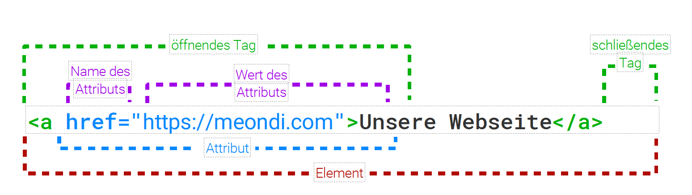

# Gestalte deine eigene Webseite

> bunte-nacht-der-digitalisierung-html-workshop

# HTML → Hypertext Markup Language

## Aufbau von HTML Elementen

### Bereiche einteilen über HTML5

| HTML5-Befehle                | Beschreibung                                       |
|------------------------------|----------------------------------------------------|
| \<header\> ... \</header\>   | Bereich für Kopf (nicht verwechseln mit \<head\>!) |
| \<nav\> ... \</nav\>         | Bereich Navigation (Steuerung)                     |
| \<section\> ... \</section\> | Gruppiert Elemente                                 |
| \<article\> ... \</article\> | Bereich für Inhalt                                 |
| \<aside\> ... \</aside\>     | Bereich für Zusatzinformationen zum Inhalt         |
| \<footer\> ... \</footer\>   | Bereich für Fuß                                    |

### Text strukturieren

| HTML-Befehle                          | Beschreibung                                                                                                  |
|---------------------------------------|---------------------------------------------------------------------------------------------------------------|
| \<h1\> … \</h1\>                      | Hauptüberschrift - wichtig, sollte einmal auf jeder einzelnen Seite kommen (engl. h = headline = Überschrift) |
| \<h2\> … \</h2\> bis \<h6\> … \</h6\> | Unterüberschriften - sollten in der logischen Reihenfolge verwendet werden. Nach \<h2\> kommt \<h3\>          |
| \<p\> … \</p\>                        | Absatz - nach dem Absatz wird automatisch Platz gehalten (engl. p = paragraph = Absatz)                       |
| \<br\>                                | erzwungener Zeilenumbruch (Zeilenende) (engl. br = break = Umbruch)                                           |
| \<hr\>                                | Trennlinie - trennt unterschiedliche Inhalte (engl. hr = horizontal ruler = horizontale Linie)                |

und viele weitere [hier](https://www.html-seminar.de/befehlsuebersicht.htm)

## Probiere es selber aus

Super, wenn du es bis hier hergeschafft hast. Lass uns gemeinsam an deiner Webseite bauen.

Melde dich, sofern du es noch nicht bis, oben rechts bei Github an und kehre anschließend 
wieder hier her zurück. Danach drücken wird den Punkt `.` auf der Tastatur und es öffnet 
sich die Programmierumgebung, mit der wir loslegen können.

# Weiterführende Ressourcen

## HTML und CSS Lexika

Hier kannst du alle HTML- und CSS-Elemente nachschlagen und dir genau anschauen, wie die Elemente funktionieren.
Inklusive Beispielen zum Ausprobieren!
• Developer Guidelines von Mozilla (https://developer.mozilla.org/de/docs/Web/HTML)
• W3Schools (https://www.w3schools.com/tags/default.asp)

## Online-Programmierkurse

Hier kannst du auf verschiedenen Plattformen interaktiv weiterlernen. Die Kurse sind sowohl für Anfänger*innen als auch
Fortgeschrittene geeignet.
• Programmieren mit der Maus (https://programmieren.wdrmaus.de/)
• Computer Science First von Google (https://cs-first.com)
• Scratch (https://scratch.mit.edu/)
• Thimble (https://thimble.mozilla.org/de/)
• Made with Code (Englisch, https://www.madewithcode.com/)
• SoloLearn (Englisch, https://sololearn.com)
• Codecademy (English, https://www.codecademy.com/
